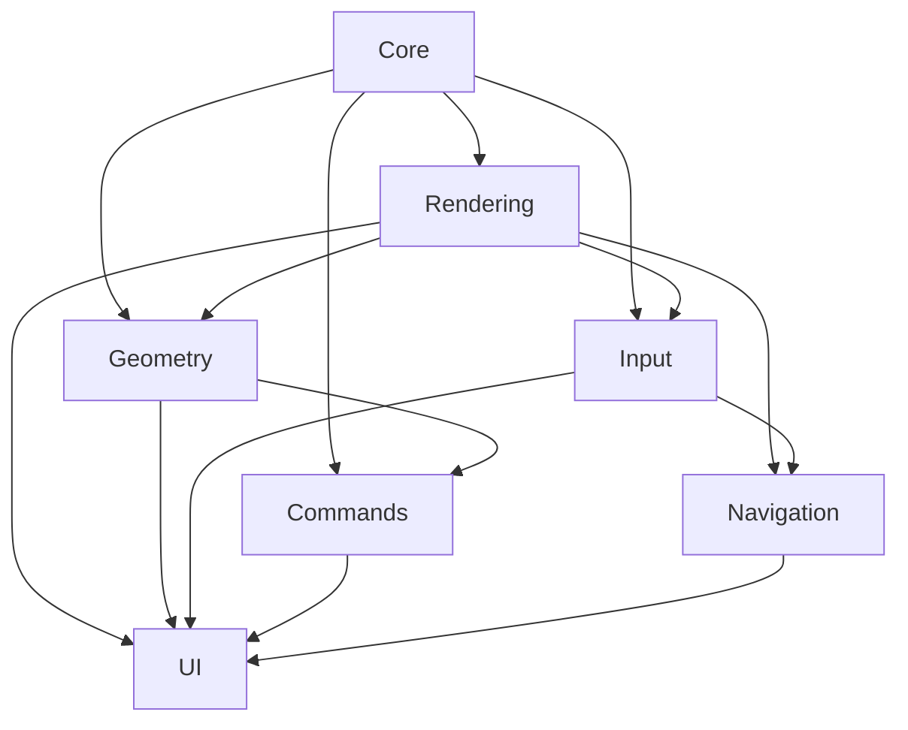

# wxcoin 模块化构建系统

本文档描述了 wxcoin 项目的模块化 CMake 构建系统，包括模块组织、依赖关系和构建指南。

## 项目架构概览

wxcoin 项目采用模块化设计，将功能按逻辑分组为独立的模块：

```
wxcoin/
├── CMakeLists.txt              # 主构建文件
├── cmake/
│   └── ModuleUtils.cmake       # CMake 工具函数
├── modules/                    # 模块目录
│   ├── core/                   # 核心模块
│   ├── rendering/              # 渲染模块
│   ├── geometry/               # 几何对象模块
│   ├── input/                  # 输入处理模块
│   ├── navigation/             # 导航模块
│   ├── commands/               # 命令系统模块
│   └── ui/                     # 用户界面模块
├── include/                    # 头文件
├── src/                        # 源文件
└── docs/                       # 文档
```

## 模块说明

### 1. Core 模块 (`wxcoin_core`)
**功能**: 基础框架和核心功能
- Application.cpp/h - 应用程序主类
- Logger.cpp/h - 日志系统
- Globals.cpp/h - 全局配置

**依赖**: 无（基础模块）

### 2. Rendering 模块 (`wxcoin_rendering`)
**功能**: 渲染引擎和DPI支持
- Canvas.cpp/h - OpenGL 渲染画布
- SceneManager.cpp/h - 3D 场景管理
- CoordinateSystemRenderer.cpp/h - 坐标系渲染
- DPIManager.cpp/h - DPI 缩放管理
- DPIAwareRendering.cpp/h - DPI 感知渲染

**依赖**: Core, wxWidgets, Coin3D, OpenGL

### 3. Geometry 模块 (`wxcoin_geometry`)
**功能**: 几何对象管理
- GeometryObject.cpp/h - 几何对象基类
- GeometryFactory.cpp/h - 几何对象工厂
- PickingAidManager.cpp/h - 拾取辅助

**依赖**: Core, Rendering

### 4. Input 模块 (`wxcoin_input`)
**功能**: 输入设备处理
- InputManager.cpp/h - 输入管理器
- MouseHandler.cpp/h - 鼠标事件处理

**依赖**: Core, Rendering

### 5. Navigation 模块 (`wxcoin_navigation`)
**功能**: 3D 场景导航
- NavigationCube.cpp/h - 导航立方体
- NavigationController.cpp/h - 导航控制器
- NavigationStyle.cpp/h - 导航样式
- NavigationCubeConfigDialog.cpp/h - 配置对话框

**依赖**: Core, Rendering, Input

### 6. Commands 模块 (`wxcoin_commands`)
**功能**: 命令系统和撤销/重做
- Command.cpp/h - 命令基类
- CreateCommand.cpp/h - 创建命令

**依赖**: Core, Geometry

### 7. UI 模块 (`wxcoin_ui`)
**功能**: 用户界面组件
- MainFrame.cpp/h - 主窗口
- ObjectTreePanel.cpp/h - 对象树面板
- PropertyPanel.cpp/h - 属性面板
- PositionDialog.cpp/h - 位置对话框

**依赖**: 所有其他模块

## 依赖关系图



## 构建配置选项

在主 CMakeLists.txt 中定义了以下构建选项：

```cmake
option(BUILD_SHARED_LIBS "Build shared libraries" OFF)
option(ENABLE_TESTING "Enable unit testing" OFF)
option(ENABLE_HIGH_DPI "Enable high-DPI support" ON)
option(ENABLE_DEBUG_LOGS "Enable debug logging" ON)
```

## 构建步骤

### 1. 配置构建环境

```bash
# 使用 vcpkg 安装依赖
vcpkg install wxwidgets coin3d opengl

# 配置 CMake
cmake .. -G "Visual Studio 17 2022" -A x64 \
    -DCMAKE_TOOLCHAIN_FILE="D:/repos/vcpkg/scripts/buildsystems/vcpkg.cmake" \
    -DwxWidgets_ROOT_DIR="D:/repos/vcpkg/installed/x64-windows"
```

### 2. 编译项目

```bash
# 编译所有模块
cmake --build . --config Release

# 编译特定模块
cmake --build . --target wxcoin_rendering --config Debug
```

### 3. 安装

```bash
# 安装到指定目录
cmake --install . --prefix "./install"
```

## 模块开发指南

### 添加新模块

1. 在 `modules/` 目录下创建新模块目录
2. 创建模块的 `CMakeLists.txt` 文件
3. 在主 `CMakeLists.txt` 中添加 `add_subdirectory(modules/new_module)`
4. 设置适当的依赖关系

### 模块 CMakeLists.txt 模板

```cmake
cmake_minimum_required(VERSION 3.20)
set(MODULE_NAME wxcoin_new_module)

# Sources and headers
set(MODULE_SOURCES
    ${CMAKE_SOURCE_DIR}/src/NewModule.cpp
)

set(MODULE_HEADERS
    ${CMAKE_SOURCE_DIR}/include/NewModule.h
)

# Create library
add_library(${MODULE_NAME} STATIC ${MODULE_SOURCES} ${MODULE_HEADERS})

# Properties and dependencies
set_target_properties(${MODULE_NAME} PROPERTIES
    OUTPUT_NAME "new_module"
    DEBUG_POSTFIX "_d"
    FOLDER "Modules"
)

target_link_libraries(${MODULE_NAME} PUBLIC
    wxcoin_core  # 根据需要添加依赖
    ${wxWidgets_LIBRARIES}
    Coin::Coin
)
```

## 调试和排错

### 查看模块信息

CMake 配置时会输出详细的模块信息：

```
=== wxcoin Project Configuration ===
Project: wxcoin v1.0.0
Build type: Release
High-DPI support: ON
Debug logs: ON
C++ standard: 17
====================================
```

### 常见问题

1. **模块依赖循环**: 确保依赖关系是单向的
2. **头文件找不到**: 检查 `target_include_directories` 设置
3. **链接错误**: 验证模块依赖顺序和库链接

### 性能优化

- 使用静态库减少运行时开销
- 并行编译: `cmake --build . --parallel`
- 增量构建: 只重新构建修改的模块

## 未来扩展

模块化设计便于未来扩展：

- **Testing 模块**: 单元测试和集成测试
- **Scripting 模块**: Python/Lua 脚本支持
- **Export 模块**: 文件导入/导出功能
- **Animation 模块**: 动画和时间轴支持

## 总结

模块化构建系统的优势：

- **可维护性**: 清晰的代码组织和依赖关系
- **可扩展性**: 易于添加新功能模块
- **编译效率**: 增量编译和并行构建
- **代码重用**: 模块可独立使用
- **团队开发**: 不同团队可专注不同模块 